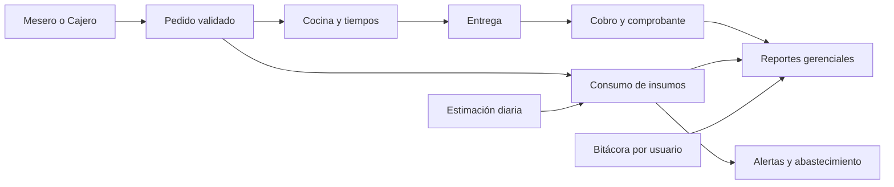

# RestoControl - matriz de cumplimiento

Fuente revisada: `Avance 3 - Grupo 1 (1).pdf`, secciones 1.10.1 y 1.10.2.

## Objetivo del proyecto

RestoControl centraliza pedidos, cocina, caja, inventario y reportes para reducir errores y demoras, controlar insumos y respaldar decisiones operativas con información compartida entre roles.



## Requerimientos funcionales

| Actor | Requisitos | Estado | Evidencia principal |
|---|---:|---|---|
| Administrador | RF-A01 a RF-A15 | Cumplidos | Usuarios y roles; menú, categorías y recetas; inventario; disponibilidad; Auditoría general. |
| Cajero | RF-C01 a RF-C15 | Cumplidos | Inicio de sesión; pedidos de salón, para llevar y delivery; edición previa; anulación; cobros parciales/completos; comprobante y cierre. |
| Mesero | RF-M01 a RF-M15 | Cumplidos | Gestión de mesas; comandas; observaciones y solicitudes; envío a Cocina; reapertura; cuenta, transferencia, cambio de mesa y finalización. |
| Jefe de Cocina | RF-JC01 a RF-JC10 | Cumplidos | Comandas ordenadas; observaciones; estados; agotados conectados con Caja/Salón; historial por turno y tiempos estimados. |
| Encargado de Almacén | RF-EA01 a RF-EA10 | Cumplidos | Ingresos, retiros, ajustes, stock mínimo, alertas, historial, proveedores, compras y consumo asociado a pedidos. |
| Gerente | RF-G01 a RF-G15 | Cumplidos | Dashboard; ventas por día/semana/mes; rankings; consumo; anulaciones; modalidades; movimientos; agotados; Auditoría por usuario; exportación y filtros. |

Total: **80 de 80 requisitos funcionales cubiertos** una vez aplicada la migración V14.

> Nota documental: los títulos RF-G01 a RF-G15 del PDF fueron copiados de la tabla del Administrador y no coinciden con sus descripciones. La implementación sigue las descripciones gerenciales, que especifican indicadores, reportes, exportación y auditoría.

## Requerimientos no funcionales

| Id | Estado técnico | Evidencia / condición |
|---|---|---|
| RNF-01 Seguridad | Implementado | JWT, BCrypt, autorización backend por roles, rutas frontend protegidas, secretos y orígenes configurables por entorno. |
| RNF-02 Usabilidad | Implementado | Interfaz responsiva, navegación por rol, estados vacíos/carga/error y tema claro/oscuro. |
| RNF-03 Rendimiento | Implementado con validación operativa pendiente | Índices, consultas paginadas, carga diferida de vistas, límite cliente de 5 s y medición de duración en auditoría. El SLA debe comprobarse con pruebas de carga en el entorno final. |
| RNF-04 Disponibilidad | Soportado; depende del despliegue | `/actuator/health` y sondas de vida/preparación permiten monitoreo. El 99 % sólo puede demostrarse con infraestructura desplegada y medición continua. |
| RNF-05 Escalabilidad | Implementado | Módulos desacoplados, migraciones Flyway y rutas cargadas por demanda. |
| RNF-06 Mantenibilidad | Implementado | Separación Controller, DTO, Entity, Repository, Service, Security y vistas/servicios frontend. |
| RNF-07 Compatibilidad | Preparado; requiere matriz real | Vue, CSS responsivo y APIs web estándar. Debe ejecutarse la lista de comprobación en Chrome/Edge y Firefox de las versiones objetivo. |
| RNF-08 Testeabilidad | Implementado | Suite unitaria backend, lint estático y build reproducible del frontend. |
| RNF-09 Confiabilidad | Implementado | Validaciones de dominio, manejador uniforme de excepciones, mensajes de error y auditoría tolerante a fallos. |
| RNF-010 Auditabilidad | Implementado | Logs rotativos y tabla `auditoria_operaciones` consultable por Administrador y Gerente. |

## Puesta en marcha segura

1. Copiar `.env.example` como `.env` sin versionar.
2. Configurar `DB_URL`, `DB_USERNAME`, `DB_PASSWORD` y un `JWT_SECRET` Base64 propio.
3. Iniciar el backend para que Flyway aplique V1 a V14.
4. Configurar `VITE_API_URL` en el frontend si la API no está en `http://localhost:8080/api`.
5. Verificar `/actuator/health`, iniciar sesión con cada rol y ejecutar el flujo pedido -> cocina -> inventario -> caja -> reportes -> auditoría.

## Comandos de verificación

```powershell
# Backend (omite únicamente pruebas que requieren la base remota)
.\mvnw.cmd '-Dtest=!RestoControlApplicationTests,!AlertaInventarioDatabaseTests' test

# Frontend
npx oxlint .
npx eslint . --cache
npm run build
```
